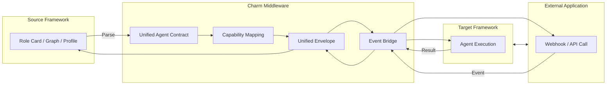

## Charm Middleware

### Input & Abstraction
#### Semantic Adapter
Agent Adapter
- Definition standardization: Parses agent definitions and transforms them into the Unified Agent Contract (UAC)
- Capability Mapping: Aligns declared agent capabilities with the target system’s available tools or plugins, mapping them into Charm’s standardized scopes, while supporting graceful degradation

App Adapter
- Semantic Conversion: Translates app-specific behaviors and events into the Connector Contract (CC)
- API Mapping: Maps these unified actions and events to each app’s concrete API schemas

### Transport & Sync

Unified Envelope
- Embeds correlation metadata into all cross-system messages, ensuring consistent task identity

Stateful Event Bridge
- Outbound: Streams agent outputs to external system
- Inbound: Subscribes to responses/triggers and reattaches them to the correct task state
- Lifecycle-Aware: Supports pause/wait/resume, retry/backoff, and reactivation

#### [Transport Plugins](https://www.notion.so/Agent-Transport-27d09131ecb5801b835cc1076f025c71?source=copy_link)

### Governance & Security
Edge Governance
- Enforces quotas, rate limits, and concurrency control
- Handles stateless retry/backoff and automated recovery
- Provides a secure outbound API wrapper for agent calls

Secrets & Credential Vault
- Injects credentials during execution based on metadata mapping
- Ensures tenant isolation, scoped access, encryption at rest/in transit, and full audit trails
