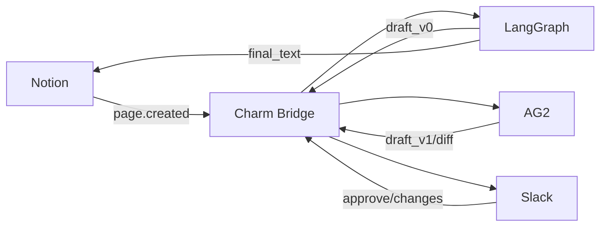

### Flow

```mermaid
flowchart LR
    N[Notion] -- page.created --> C[Charm Bridge]
    C --> L[LangGraph]
    L -- draft_v0 --> C
    C --> G[AG2]
    G -- draft_v1/diff --> C
    C --> H[Slack]
    H -- approve/changes --> C
    L -- final_text --> N
```
