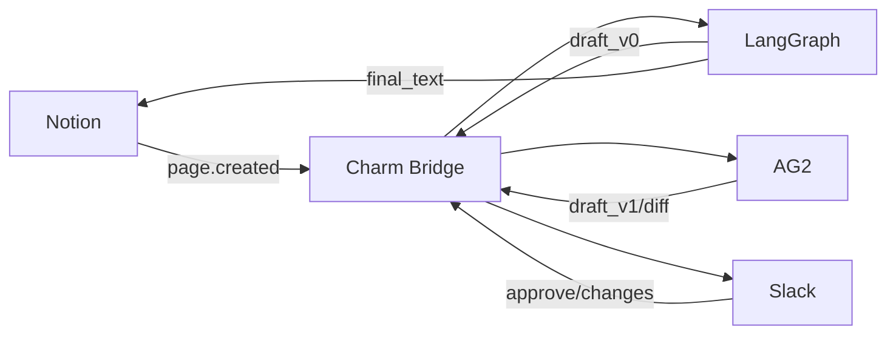

## Agent Migration

### Flow


Reference your agent (role card / node graph / profile)
```.yaml
# File path
source_type: "langgraph"       
definition_ref: "./samples/langgraph_subgraph.yaml" 
# URL
source_type: "langgraph"
definition_ref: "https://example.com/agent/langgraph_subgraph.yaml"
```
Inline Example
```.yaml
source_type: "langgraph"
definition_inline:
  persona:
    name: "ResearchAgent"
  goals:
    - "Summarize the current AI industry"
  tools:
    - notion.read_page
    - slack.send_message
```
Translated into UAC format
```.ts
const uac = await charm.uac.transform({
  source_type: "langgraph",
  definition_ref: "./samples/langgraph_subgraph.yaml" 
```
Select the output framework and perform mapping
```.ts
const ag2Profile = await charm.adapter.render({
  targetFramework: "AG2",
  uac
})
```
Degradation Strategy - UAC declaration
```.yaml
capabilities:
  - send_message
  - read_database
policies:
  use_secure_wrapper_if_missing: true
  require_human_on_irreversible_actions: true
```
Agent handoff
```.ts
const task = await charm.task.start({
  action: "generate_report",
  input: { topic: "AI industry (current)" },
  session_id: "s_123" 
})

await charm.task.resume({ task_id: task.id, token: resumeToken })
```

## Application integration
Capability declaration (if definition is not provided)
```.yaml
capabilities:
  - send_message
  - read_page
  - create_record
```
Setup your Identifier
```.json
{
  "user_id": "u_42",      
  "org": "acme_corp"      
}
```
Semantic action call
```.ts
await charm.actions.call(
  "read_database",
  { source: "notion", query: "AI companies 2025" },
  { user_id: "u_42", org: "acme" } 
)
```
