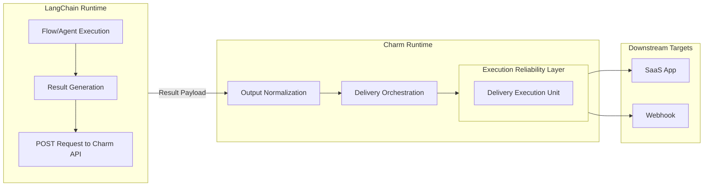

```mermaid
flowchart LR

  %% Left: Upstream
  subgraph LC[LangChain Runtime]
    direction TB
    A1[Flow/Agent Execution]
    A2[Result Generation]
    A3[POST Request to Charm API]
    A1 --> A2 --> A3
  end

  %% Middle: Charm
  subgraph CH[Charm Runtime]
    direction TB
    B1[Output Normalization]
    B2[Delivery Orchestration]
    subgraph ER[Execution Reliability Layer]
      direction TB
      B3[Delivery Execution Unit]
    end
    B1 --> B2 --> ER
  end

  %% Right: Targets
  subgraph DST[Downstream Targets]
    direction TB
    C1[SaaS App]
    C2[Webhook]
  end

  %% Main edges (Left -> Middle -> Right)
  LC -->|Result Payload| B1
  ER --> C1
  ER --> C2
```
