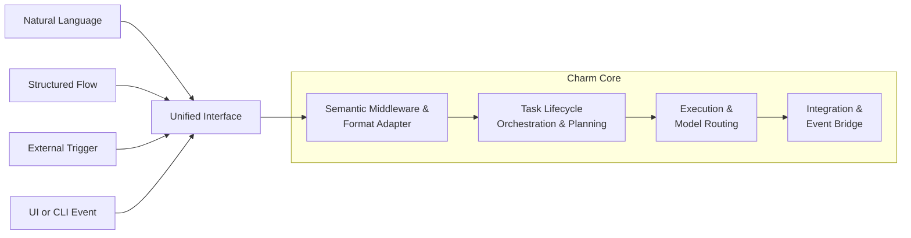
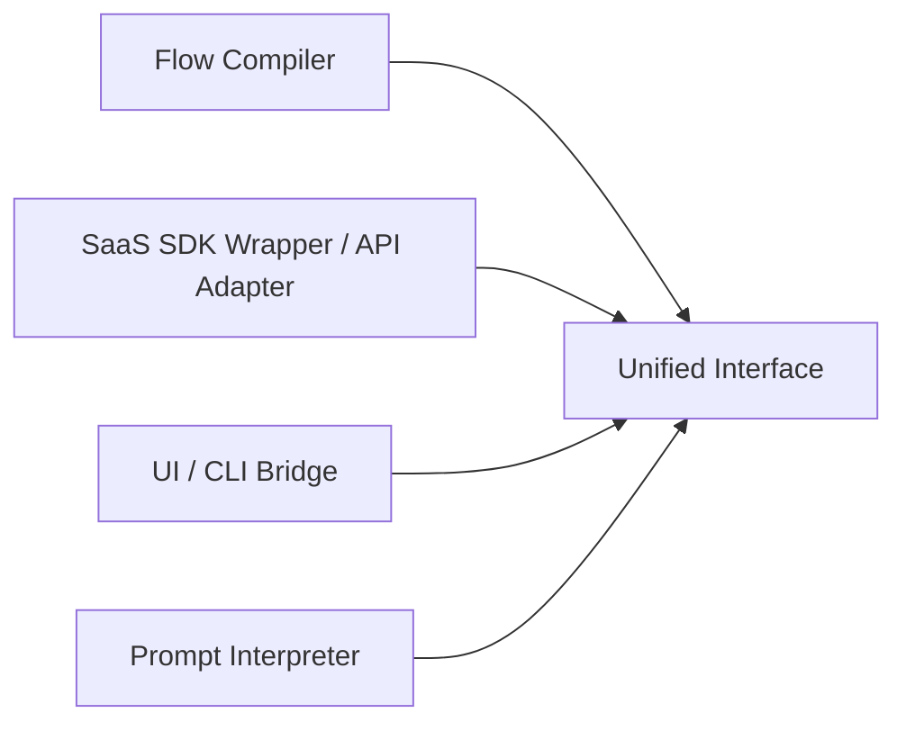
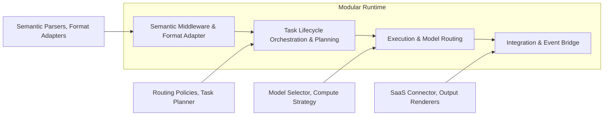

# Welcome to Charm

Charm is an open-source modular AI operating system that enables developers to compose, deploy, and scale AI applications across models, tools, frameworks, and SaaS platforms — all through a single unified API and plugin-based architecture.

## Core feature modules

**Execution & Model Routing**:
Intelligently selects and adapts the optimal model and compute backend based on routing policies, with built-in support for fallback strategies, token quota enforcement, and dynamic resource allocation.

**Orchestrator & Lifecycle Manager**:
Orchestrates multi-agent workflows with complete task lifecycle control—including planning, execution, error recovery, and inter-agent handoff—with full traceability and execution observability.

**Semantic Middleware & Format Adapter**:
Standardizes and transforms diverse inputs into structured semantic formats, enabling seamless routing, validation, and cross-platform compatibility.

**Integration & Event Bridge**:
Facilitates bidirectional communication with external platforms via APIs, webhooks, or event polling—supporting asynchronous triggers, state-based reactivation, and real-time task continuation.


## Architecture


1. Unified Ingestion:
Accepts and normalizes inputs from diverse external sources—agent frameworks (e.g., LangChain, AG2), automation platforms (e.g., Zapier, Notion), and protocol-based triggers (e.g., MCP)—through pluggable adapters.


2. Pluggable Execution Layers:
All major subsystems—model selection, orchestration engine, semantic formatting, and event handling—expose plugin interfaces. Developers can inject or swap components (e.g., LLM backends, flow planners, SDK bridges, monitoring hooks) to meet custom runtime requirements without altering core system logic.



3. Plugin-based Orchestration:
All tasks flow through a unified orchestration pipeline. The system dynamically invokes external plugins—such as planning modules, inference providers, or application integrations—delivering full-stack, cross-platform workflows.

```mermaid
flowchart LR

        Z1[Task Trigger]

    subgraph Charm Core
        A1[Task Orchestrator]
        A2[Planning Engine]
        A3[Execution Engine]
        A4[Output Dispatcher]
    end

    subgraph Plugins
        P1[LangChain Planner]
        P2[OpenRouter Compute]
        P3[Slack Webhook]
    end

    Z1 --> A1
    A1 --> A2
    A2 --> P1 --> A3
    A3 --> P2
    A3 --> A4
    A4 --> P3
