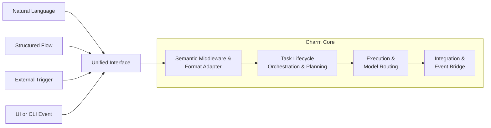
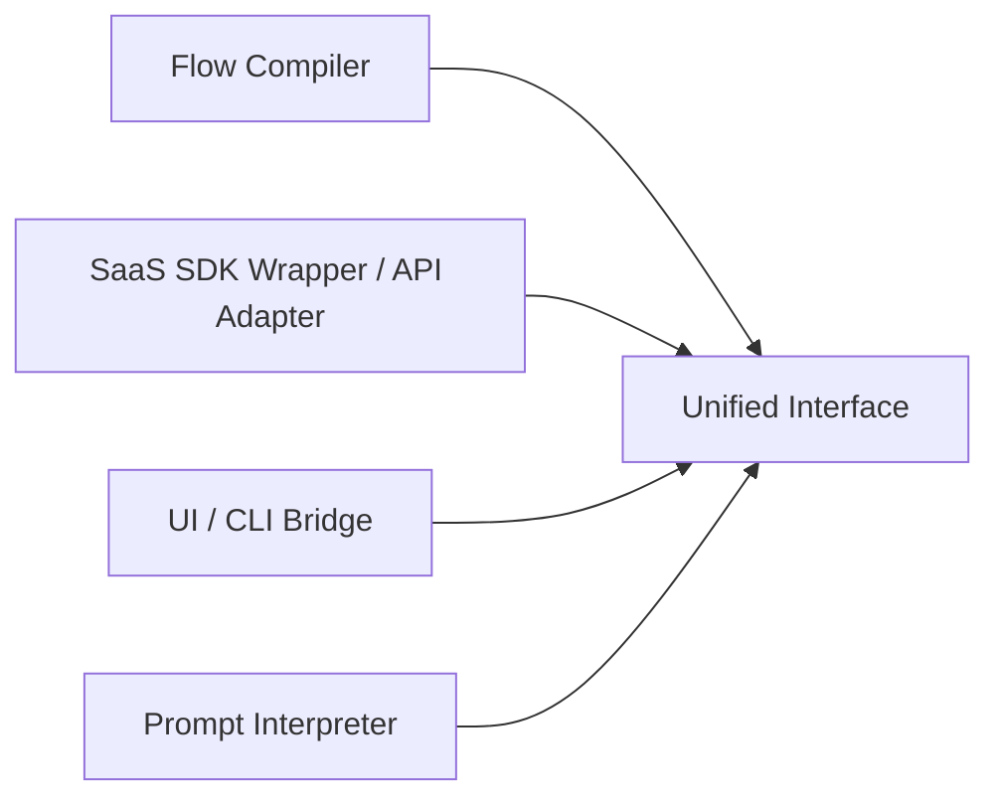
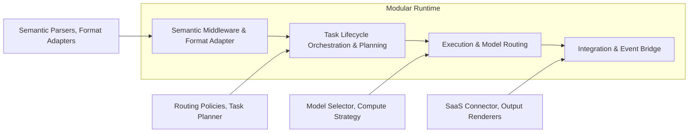

# Welcome to Charm

Charm is an open-source modular AI operating system that enables developers to compose, deploy, and scale AI applications across models, tools, frameworks, and platforms — all through a single unified API and plugin-based architecture.

## Core feature modules

**Execution Routing**:
Intelligently selects and adapts the optimal model and compute backend based on defined needs and policies, with built-in support for resource governance.

**Multi-Agent Management**:
Orchestrates multi-agent workflows with full lifecycle control, inter-agent handoff, and complete execution traceability.

**Semantic & Format adaptation**:
Standardizes diverse inputs into structured semantics & formats.

**Integration Bridge**:
Supporting multi-turn and long-horizon agent workflows through persistent, bidirectional communication with external platforms via APIs, webhooks, and event polling.

## Architecture

Unified Ingestion:
Accepts and normalizes inputs from diverse external sources (e.g., agent frameworks, iPaaS, protocol-based triggers) through pluggable adapters.

Pluggable Orchestration & Execution:
All tasks flow through a unified orchestration pipeline, where major subsystems expose plugin interfaces that allow you to inject or swap components (e.g., model routers, workflow planners, or SDK bridges) to compose workflows tailored to custom runtime requirements

