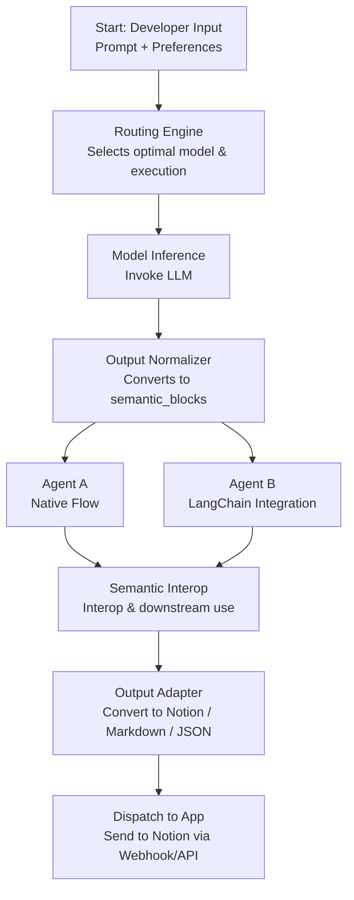

### Objective
Showcase how the CharmOS runtime completes a full task workflow from prompt to application-ready output, and demonstrates how to integrate outputs from existing frameworks such as LangChain or Dify into downstream processes.

### Demoflow



  
```mermaid
graph TD
  A[User Prompt / Task Config] --> B[Unified API Interface]
  B --> C[Routing Engine]
  C --> D[Model Inference (Mock)]
  D --> E[Output Normalizer]
  E --> F1[Semantic Blocks A (Native)]
  L[LangChain Output (Simulated)] --> M[LangChain Adapter]
  M --> F2[Semantic Blocks B (External)]
  F1 --> G[Format Adapter]
  F2 --> G
  G --> H[Multi-format Output<br>Notion / Markdown / JSON]
  G --> I[Semantic Handoff<br>Inject into Agent B]

graph TD
  A[User Prompt / Task Config] --> B[Unified API Interface]
  B --> C[Routing Engine]
  C --> D[Model Inference (Mock)]
  D --> E[Output Normalizer]
  E --> F1[Semantic Blocks A (Native)]

  %% Agent B simulated entry point
  L[Simulated LangChain Output] --> M[LangChain Adapter]
  M --> F2[Semantic Blocks B (from Agent B)]

  %% Interop
  F1 --> H[Semantic Handoff<br>Inject Blocks A ➝ Agent B]
  H --> F2

  %% Output
  F2 --> G[Format Adapter]
  G --> I[Multi-format Output<br>Notion / Markdown / JSON]
  I --> J[Dispatch to App<br>Webhook / API]
```
#### Modules Overview

| Module | Title | Purpose |
|--------|-------|---------|
| 01 | `01_unified_interface.md` | Launch a task using CLI or unified API – entry point for all workflows |
| 02 | `02_routing_and_model_selection.md` | Mock routing logic based on task preference (e.g., latency, privacy) |
| 03 | `03_semantic_abstraction.md` | Normalize model output into structured internal semantic schema |
| 04 | `04_interoperability.md` | Demonstrate semantic composability between native and external agents |
| 05 | `05_output_adapter.md` | Format and dispatch structured output to tools like Notion or webhooks |
| 06 | `06_execution_trace.md` | Log the modular execution flow step-by-step |

### Modules Covered

- **Developer SDK & Interface**
- **Routing Criteria Parser**
- **Routing Engine**
- **Inference Execution Layer** (mocked)
- **Format & Semantic Abstraction Layer**
  - AI Output Normalization
  - LangChain Adapter
  - Structured Output Schema
- **External IPC & API Adapter Layer**
  - Output Dispatcher

### Core Demo Value

**Semantic-driven orchestration**: Show how model output becomes interoperable semantic units that power downstream tasks.
- **Modular execution flow**: Each step is independently traceable and replaceable, validating our plug-and-play design.
- **Protocol & framework compatibility**: Simulates seamless ingestion of LangChain/Dify-style output into our unified workflow.
- **End-to-end AI task execution**: From prompt input to Notion-ready content, this demo proves our OS runtime vision.
- **Developer-ready runtime philosophy**: Even mock data illustrates how CharmOS can serve as the backbone for AI-native apps.
