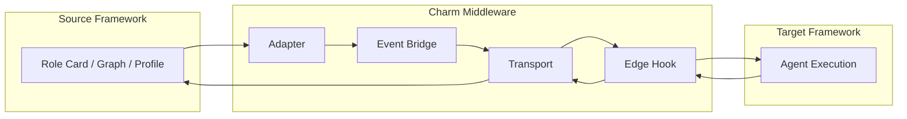

## Charm Middleware Architecture

### Flow Visualization

### Core Modules
#### Agent Adapter
- Definition standardization: Parses agent definitions and transforms them into the Unified Agent Contract (Charm UAC)
- Capability Mapping: Aligns the agent’s declared capabilities with the target system’s available tools or plugins, registers them into the runtime, and supports graceful degradation

#### Stateful Bridge
- Outbound: Streams agent outputs to external system
- Inbound: Subscribes to responses/triggers and reattaches them to the correct task state
- Lifecycle-Aware: Supports pause/wait/resume, retry/backoff, and reactivation

#### Transport 
- Handles low-latency, bidirectional communication with external agent systems
- Support task resumption routing, correlation-aware message delivery

#### Edge Governance
- Enforces quotas, rate limits, and concurrency control
- Handles stateless retry/backoff and automated recovery
