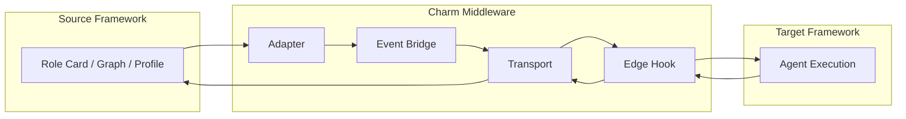

## Charm Middleware Architecture

### Flow Visualization

### Core Modules
#### Agent Adapter
The Agent Adapter handles the entire portability pipeline: it parses source-framework agent definitions, normalizes them into a Unified Agent Contract (uac), resolves all semantic fields (role, capabilities, workflow), and compiles the result into a runnable profile for the target framework. It ensures that one agent definition can be executed across different ecosystems without rewriting logic.

#### Stateful Bridge
The Stateful Bridge connects execution between frameworks. It converts runtime steps into event streams, sends them to the target framework, and reattaches incoming results to the correct task or node. Allowing a single agent flow to span multiple frameworks while remaining logically continuous.

#### Transport 
Transport provides the bidirectional communication channel. It delivers events between Charm and external frameworks with low latency, handles encoding, routing, ordering, and correlation IDs, and ensures every message reaches the correct session, task, or node.

#### Edge Governance
Edge Governance enforces resource and execution policies at the system boundary. It applies rate limits, quotas, concurrency rules, and retry/backoff strategies to all cross-framework events, ensuring stable execution and safe fallback behavior during portability or bridge operations.
