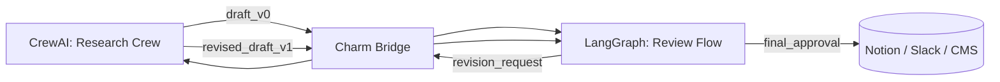

# CrewAI → LangGraph Use Case: Research Agent

> This is a conceptual use case to illustrate the portability flow.
> Code examples and runnable fixtures will be added in later releases.

## Overview

This project demonstrates how a research-oriented multi-agent system built with CrewAI can be extended through LangGraph into a stateful, self-refining workflow.

The agents initially collaborate within CrewAI’s role-based environment to conduct research, analysis, and report drafting. Through Charm, the system is extended into a LangGraph-based refinement pipeline that manages review, revision, and validation loops.

---

## Flow Visualization

## Description
### CrewAI: Research Phase
- Crew: Researcher, Analyst, Writer
- Output: Initial research report draft_v0
### Charm: Bridge Phase
- Converts the CrewAI agent’s definition and portable configuration into a unified UAC Object, preserving roles, goals, and capabilities for downstream mapping
- Constructs a runtime bridge that maps CrewAI tasks to LangGraph nodes and binds configuration contexts such as tools, policies, and model preferences
- Injects execution envelopes and governance hooks to manage lifecycle, degradation, and state tracking across frameworks
### LangGraph: Refinement Phase
- Stateful graph:
  - review_node: checks logical consistency
  - revision_node: asks for improved sections
  - validation_node: ensures completeness
- If needs_revision == true, loops back to CrewAI through Charm Bridge
### Charm: Rerun Phase
- Transfers revision requests back to CrewAI environment
- Maintains unified agent context and role integrity

## Outcome
By bridging the two frameworks and enabling continuous synchronization of agent context and outputs, the same research crew evolves into a dynamic and autonomous editorial workflow.

The result is a cross-framework system that combines CrewAI’s collaborative intelligence with LangGraph’s stateful orchestration, producing higher-quality, version-controlled results with minimal human supervision.
