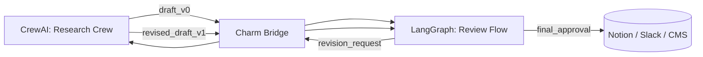

# CrewAI → LangGraph Use Case: Research Agent

> This is a conceptual use case to illustrate the portability flow.
> Code examples and runnable fixtures will be added in later releases.

## Overview

This use case demonstrates how a research-oriented multi-agent system built with CrewAI can be extended through Charm to connect with LangGraph, transforming the agents into a stateful and self-refining editorial workflow.
The system manages review, revision, and validation cycles, forming a cross-framework architecture that combines CrewAI’s collaborative intelligence with LangGraph’s stateful orchestration—producing higher-quality, version-controlled results with minimal human supervision.

---

## Flow Visualization

## Description
### CrewAI: Research Phase
- Crew: Researcher, Analyst, Writer
- Output: Initial research report draft_v0
### Charm: Bridge Phase
- Uses the UAC definition together with live CrewAI outputs as inputs to the bridge.
- Mounts a runtime bridge that maps CrewAI tasks to LangGraph nodes and synchronizes agent state across frameworks (without embedding state into the UAC).
- Injects standardized execution envelopes and governance hooks for controlled degradation, approvals, and lifecycle tracking.
- Hands off a LangGraph-compatible workflow (review → revise → validate) with bridge bindings, ready for execution under Charm’s orchestration.
	•	Converts the CrewAI agent definition and configuration into a unified UAC Object, preserving roles, goals, and runtime context.
	•	Establishes a runtime bridge that maps CrewAI tasks to LangGraph nodes and maintains bidirectional state synchronization across frameworks.
	•	Injects standardized execution envelopes and governance hooks to manage lifecycle, logging, and controlled capability degradation.
	•	Generates a LangGraph-compatible workflow (review → revise → validate) ready for execution under Charm’s orchestrated runtime.
### LangGraph: Refinement Phase
- Stateful graph:
  - review_node: checks logical consistency
	- revision_node: asks for improved sections
	- validation_node: ensures completeness
- If needs_revision == true, loops back to CrewAI through Charm Bridge
