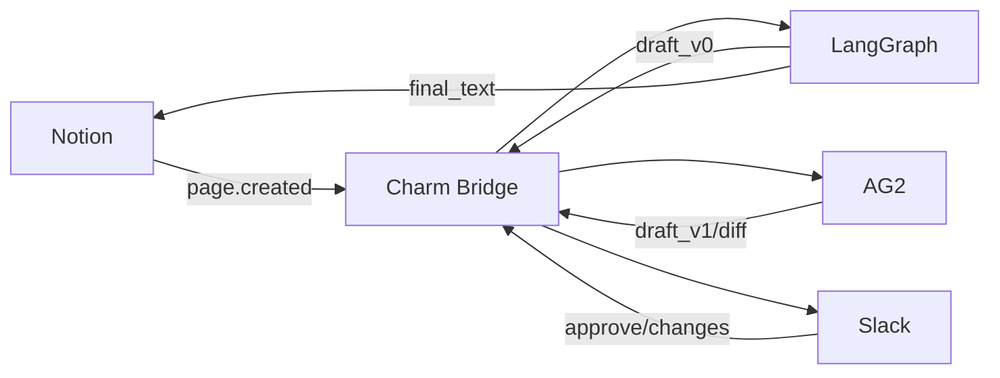

# CrewAI → LangGraph Use Case: Research Agent

> This is a conceptual use case to illustrate the portability flow.
> Code examples and runnable fixtures will be added in later releases.

## Overview

This use case demonstrates how a research-type agent originally built with CrewAI can leverage its collaborative reasoning and task-delegation capabilities, and be extended through LangGraph into an agent system with structured orchestration, persistence, and workflow control.

Through agent mapping and bridging, Charm abstracts away the boundaries between environments and frameworks, allowing developers to establish an executable cross-framework agent pipeline between CrewAI and LangGraph, while maintaining the agent’s context and synchronized state.

---

## Flow Visualization


Reference your agent (role card / node graph / profile)
```.yaml
# File path
source_type: "langgraph"       
definition_ref: "./samples/langgraph_subgraph.yaml" 
# URL
source_type: "langgraph"
definition_ref: "https://example.com/agent/langgraph_subgraph.yaml"
```
Inline Example
```.yaml
source_type: "langgraph"
definition_inline:
  persona:
    name: "ResearchAgent"
  goals:
    - "Summarize the current AI industry"
  tools:
    - notion.read_page
    - slack.send_message
```
Translated into UAC format
```.ts
const uac = await charm.uac.transform({
  source_type: "langgraph",
  definition_ref: "./samples/langgraph_subgraph.yaml" 
```
Select the output framework and perform mapping
```.ts
const ag2Profile = await charm.adapter.render({
  targetFramework: "AG2",
  uac
})
```
Degradation Strategy - UAC declaration
```.yaml
capabilities:
  - send_message
  - read_database
policies:
  use_secure_wrapper_if_missing: true
  require_human_on_irreversible_actions: true
```
Agent handoff
```.ts
const task = await charm.task.start({
  action: "generate_report",
  input: { topic: "AI industry (current)" },
  session_id: "s_123" 
})

await charm.task.resume({ task_id: task.id, token: resumeToken })
```

## Application integration
Capability declaration (if definition is not provided)
```.yaml
capabilities:
  - send_message
  - read_page
  - create_record
```
Setup your Identifier
```.json
{
  "user_id": "u_42",      
  "org": "acme_corp"      
}
```
Semantic action call
```.ts
await charm.actions.call(
  "read_database",
  { source: "notion", query: "AI companies 2025" },
  { user_id: "u_42", org: "acme" } 
)
```
