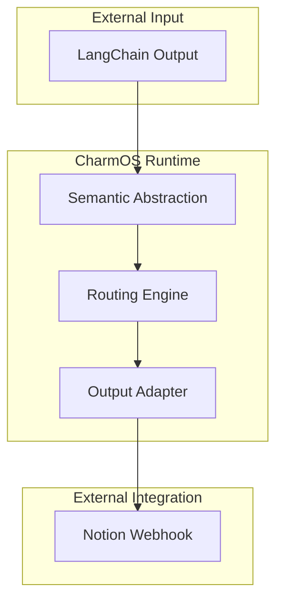

```mermaid
graph TD
  subgraph External Input
    A1[LangChain Output]
  end

  subgraph CharmOS Runtime
    B1[Semantic Abstraction]
    B2[Routing Engine]
    B3[Output Adapter]
  end

  subgraph External Integration
    C1[Notion Webhook]
  end

  A1 --> B1 --> B2 --> B3 --> C1
```
