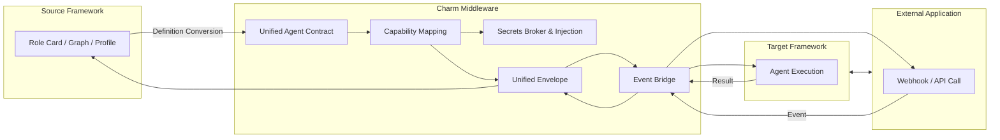

## Agent Interop Middleware

## What did we solve?
- Cross-agent ecosystem bridge
- Agent-to-world communication

## What Developers Get

#### write once, run anywhere
- Features & Capabilities
- Ecosystem Compatibility
- Resources & Community
#### Interactions with Apps, all throughout a single flow
- Resumable
- Bidirectional
- State-aware
- Governed & Secure
- Cross-framework consistent

## Scope

We handle:
- Format conversion
- Semantic mapping
- Event bridging
- Boundary governance
- Credential custody

We do NOT handle:
- Task orchestration
- Routing decisions
- Workflow scheduling
- Execution environments
- Native Agent SDK

## Roadmap

Middleware
- RBAC Granularity + SSO/SCIM
- Observability & Audit
- Schema & Contract Registry
- Plugin / Connector SDK

Runtime Environment
- Routing Decisions
- Execution Scheduler
- Compute Strategy
- Fine-grained Token/Quota Management

Full OS
- Developer SDK / GUI
- Native Agent Registry
- Plugins / Marketplace
- Compliance, Audit, Observability
