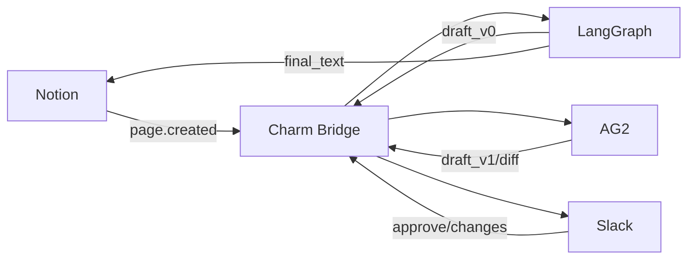

## Script

1. Defining Portability

Prepare a LangGraph-style ResearchAgent definition file (YAML/JSON)
- Agent meta: persona, goal, capabilities etc.
- Executable definition: Planner + Tools

Charm parses this file 
→ produces uac.json (Unified Agent Contract) 
→ rendered into ag2_profile.yaml (AG2 execution definition) 
→ Secrets Broker injects credentials

Note:
- Mapping report can be generated from a handwritten table
- Timeline tracks
- No need to actually run the LangGraph agent

2. Cross-Framework Handoff & Continuation

Chat UI input request 
→ LangGraph ResearchAgent retrieves data 
→ outputs draft_v0
→ Charm Bridge wraps + maintains session_id 
→ hands off draft_v0 to AG2 
→ ReviewerAgent and CriticAgent debate and revise 
→ outputs draft_v1

Note:
- Charm’s timeline keeps track of the task state so that both upstream and downstream share it.

3. Agent-to-App (Bidirectional & Resumable)

After AG2 outputs draft_v1 
→ Charm wraps 
→ sends to Chat UI (HITL) 
→ receives “Request Changes”
→ AG2 rewrites 
→ sends back to Chat UI for review (multi-turn) 
→ final result synced to Notion
