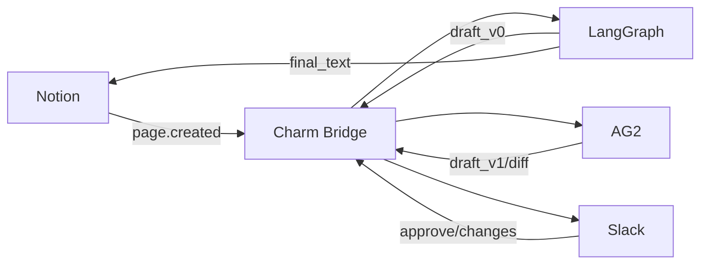
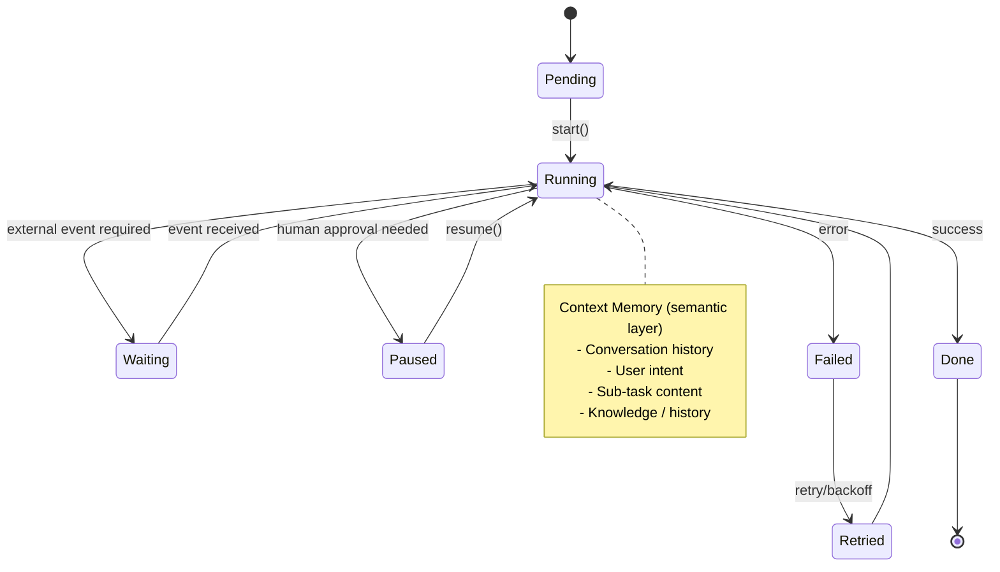

```mermaid
flowchart LR
    N[Notion] -- page.created --> C[Charm Bridge]
    C --> L[LangGraph]
    L -- draft_v0 --> C
    C --> G[AG2]
    G -- draft_v1/diff --> C
    C --> H[Slack]
    H -- approve/changes --> C
    L -- final_text --> N
```

```mermaid
stateDiagram-v2
    [*] --> Pending
    Pending --> Running : start()
    Running --> Waiting : external event required
    Waiting --> Running : event received
    Running --> Paused : human approval needed
    Paused --> Running : resume()
    Running --> Failed : error
    Failed --> Retried : retry/backoff
    Retried --> Running
    Running --> Done : success
    Done --> [*]

    note right of Running
        Context Memory (semantic layer)
        - Conversation history
        - User intent
        - Sub-task content
        - Knowledge / history
    end note
```
